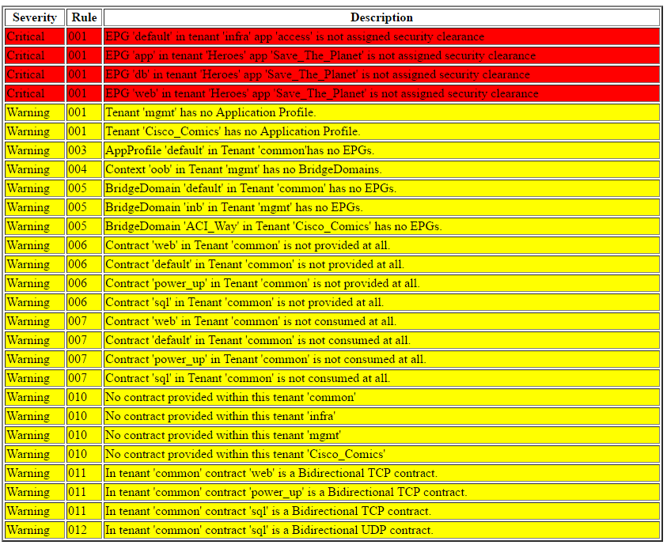
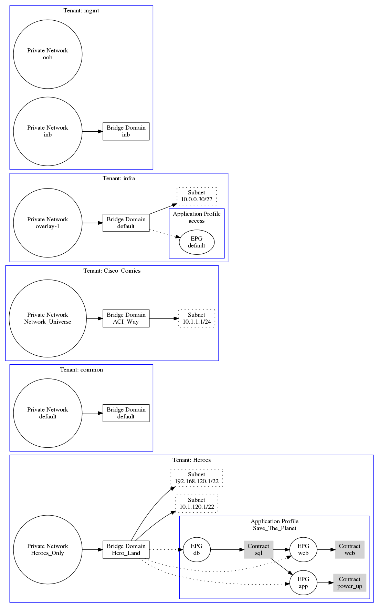
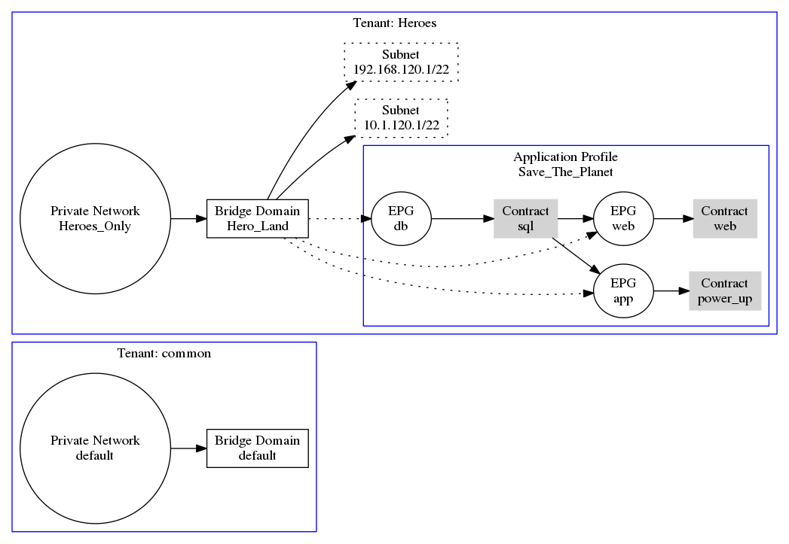

## Lab - Toolkit Applications
We have chosen to demonstrate the ACI Lint and Diagrams applications, but there are many more that exist within the Toolkit such as a CLI application, Endpoint tracker, RSS reader appliation, cable plan validation, visualizations.

### Lint
The Lint application is used to comb through the fabric and look for suspicious configurations. It looks for configurations that are not being used, or are missing some parameters and reports back with a severity level. The severity levels are "Critical", "Error", and "Warning." There is an optional feature where an admin can tag EPGs with a security level; EPGs in a higher security level will be scrutinized for compliance issues.

##### Browse to the Lint Directory
```bash
$ cd directory/path/before/toolkit/acitoolkit/applictions/lint
$ ls
acilint.py   README.md
$ 
```

##### Run the Lint Program
First run the acilint program without any arguments, and see that it prints back the results to the terminal. 
```
$ python acilint.py
APIC login username: admin
APIC URL: https://apic
APIC Password:
Getting configuration from APIC....
Processing configuration....
Critical 001: EPG 'default' in tenant 'infra' app 'access' is not assigned security clearance
Critical 001: EPG 'app' in tenant 'Heroes' app 'Save_The_Planet' is not assigned security clearance
Critical 001: EPG 'db' in tenant 'Heroes' app 'Save_The_Planet' is not assigned security clearance
Critical 001: EPG 'web' in tenant 'Heroes' app 'Save_The_Planet' is not assigned security clearance
Warning 001: Tenant 'Cisco_Comics' has no Application Profile.
Warning 001: Tenant 'mgmt' has no Application Profile.
Warning 003: AppProfile 'default' in Tenant 'common'has no EPGs.
Warning 004: Context 'oob' in Tenant 'mgmt' has no BridgeDomains.
Warning 005: BridgeDomain 'default' in Tenant 'common' has no EPGs.
Warning 005: BridgeDomain 'ACI_Way' in Tenant 'Cisco_Comics' has no EPGs.
Warning 005: BridgeDomain 'inb' in Tenant 'mgmt' has no EPGs.
Warning 006: Contract 'web' in Tenant 'common' is not provided at all.
Warning 006: Contract 'default' in Tenant 'common' is not provided at all.
Warning 006: Contract 'power_up' in Tenant 'common' is not provided at all.
Warning 006: Contract 'sql' in Tenant 'common' is not provided at all.
Warning 007: Contract 'web' in Tenant 'common' is not consumed at all.
Warning 007: Contract 'default' in Tenant 'common' is not consumed at all.
Warning 007: Contract 'power_up' in Tenant 'common' is not consumed at all.
Warning 007: Contract 'sql' in Tenant 'common' is not consumed at all.
Warning 010: No contract provided within this tenant 'common'
Warning 010: No contract provided within this tenant 'infra'
Warning 010: No contract provided within this tenant 'Cisco_Comics'
Warning 010: No contract provided within this tenant 'mgmt'
Warning 011: In tenant 'common' contract 'web' is a Bidirectional TCP contract.
Warning 011: In tenant 'common' contract 'power_up' is a Bidirectional TCP contract.
Warning 011: In tenant 'common' contract 'sql' is a Bidirectional TCP contract.
Warning 012: In tenant 'common' contract 'sql' is a Bidirectional UDP contract.
$ 
```

Next run the program with the `-o html` flag to output the results to a html file.
```
$ python acilint.py -o html
APIC login username: admin
APIC URL: https://apic
APIC Password:
Creating file lint.html
Getting configuration from APIC....
Processing configuration....
$ 
```

The second method does not print back the results, so you must open the `lint.html` file, which highlights each severity a different color.



The "Critical" messages displayed are expected since we have not made use of the optional feature that assists with identifying compliance issues. Warnings are less severe, but should also be examined in a production network.

### Diagram
The Diagram application will generate a diagram of the Tenant objects and their children for an easy to consume image of their relationships. This application does require graphviz to be installed before it will be able to draw the diagram. By default, the application will draw all Tenants, but the -t argument can be used to pass a single Tenant, or a list of desired Tenants.

##### Browse to the ACI Diagram Directory
If you are still in the lint directory:
```bash
$ ../aci-diagram
$
```
else you will need to browse to the acitoolkit/applictions/aci-diagram path:
```bash
$ cd directory/path/before/toolkit/acitoolkit/applications/aci-diagram
$ 
```
You should see the following files in the directory
```bash
$ ls
diagram.py   README.md
$
```
##### Run the Diagram Program
First run the program for all Tenants configured on the Fabric.
```bash
$ python diagram.py -o all.png
APIC login username: admin
APIC URL: https://apic
APIC Password:
Processing tenant common
Processing tenant infra
Processing tenant Cisco_Comics
Processing tenant mgmt
Processing tenant Heroes


Drawing graph to all.png
$ 
```
Open the all.png image, and you should see something similar to the below image.



Next run the program for only the common and Heroes Tenants.
```bash
$ python diagram.py -o heroes.png -t Heroes common
APIC login username: admin
APIC URL: https://apic
APIC Password:
Processing tenant common
Processing tenant Heroes


Drawing graph to heroes.png
$ 
```
Now open the Heroes.png file and you should see the below image.


