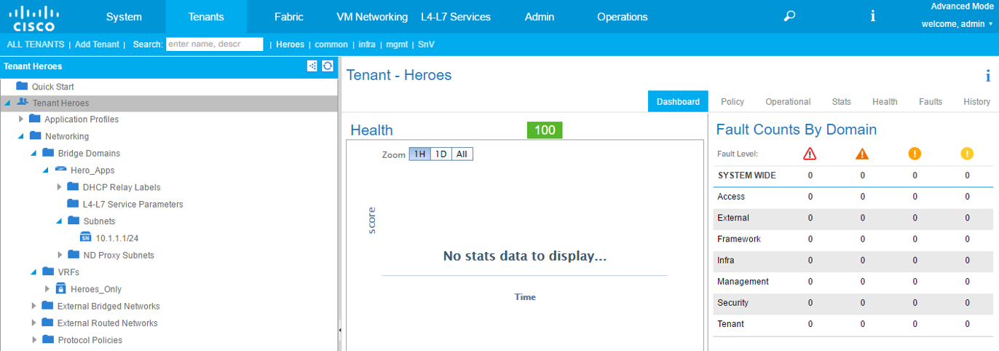

## Using the Toolkit Library

Using the Python library will be very similar to using the Cobra library. Here is a basic workflow:

1.  Import the acitoolkit library
2.  Establish a session with the APIC
3.  Store instances of MOs (Tenant, Bridge Domain, EPG, etc.) into variables
4.  View or manipulate the MOs by using the available functions from the MOs class
5.  Submit any configuration changes to the APIC


Before using the Toolkit library, you  might want to create a credentials file that can be imported instead of having to re-type login information each time. 

Make sure the file is in the directory where Python programs will be executed from, or that it is in the System Path. The file should look like this with updated parameters:

```
LOGIN = 'admin'
PASSWORD = 'password'
IPADDR = 'apic'
URL = 'https://' + IPADDR
```

The following example assumes the file was saved as `credentials.py`

Take a look at the following example that adds a new Tenant object along with a network policy to the APIC. Ensure you read the comments in the script to understand what each statement is doing.

```python
$ python
>>> 
# import credentials for login information and acitoolkit for configuration
>>> from credentials import *
>>> from acitoolkit.acitoolkit import *
>>> 
# create a connection with the apic using the Session class and login functions
>>> sess = Session(URL, LOGIN, PASSWORD)
>>> sess.login()
>>> 
# create a new tenant by using the Tenant class
>>> tenant = Tenant("Heroes")
>>> 
# add a vrf to the tenant by using the Context class and passing in the tenant object
>>> vrf = Context("Heroes_Only", tenant)
>>> 
# add a bridge domain under the tenant by calling the BridgeDomain class and passing in the tenant object
>>> bd = BridgeDomain("Hero_Apps", tenant)
>>> 
# associate the bridge domain to the vrf by using the add_context function on 
# the bridge domain object and passing in the vrf object
>>> bd.add_context(vrf)
>>> 
# add a public subnet to the bridge domain by creating an instance of the Subnet class and passing in the bridge domain object.
# the set_scope function is used to change the scope from private to public.
# the set_addr function is called to add a new subnet and gateway to the bridge domain.
>>> subnet = Subnet("Hero", bd)
>>> subnet.set_scope("public")
>>> subnet.set_addr("10.1.1.1/24")
>>> 
# confirm configuration
>>> print("\n{}\n\n{}".format(tenant.get_url(), tenant.get_json()))

/api/mo/uni.json

{'fvTenant': {'attributes': {'name': 'Heroes'}, 'children': [{'fvCtx': {'attributes': {'name': 'Heroes_Only', 'pcEnfPref': 'enforced'}, 'children': []}}, {'fvBD': {'attributes': {'name': 'Hero_Apps', 'unkMacUcastAct': 'proxy', 'arpFlood': 'no', 'multiDstPktAct': 'bd-flood', 'unicastRoute': 'yes', 'unkMcastAct': 'flood'}, 'children': [{'fvRsCtx': {'attributes': {'tnFvCtxName': 'Network_Universe'}}}, {'fvSubnet': {'attributes': {'ip': '10.1.1.1/24', 'name': 'Hero', 'scope': 'public'}, 'children': []}}]}}]}}
>>> 
# use the push_to_apic function on the the established Session object
# passing in the url and json data provided by the tenant object.
>>> resp = sess.push_to_apic(tenant.get_url(), data=tenant.get_json())
>>> 
```

If this script was exeucted, you would see the new tenant "Heroes" in the APIC GUI with the VRF, Bridge Domain, and Subnet configurations.



Now that the ACI Toolkit has been introduced, we will have you configure a new Tenant Object with a VRF, Bridge Domain, and Subnet. Once that is configured, you will use the Lint application to veiw potential configuration errors, and the Diagram application to view the Tenant relationships. Finally you will get to run a few sample scripts to view information from the ACI fabric.