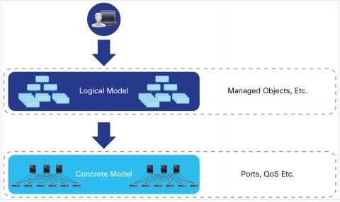
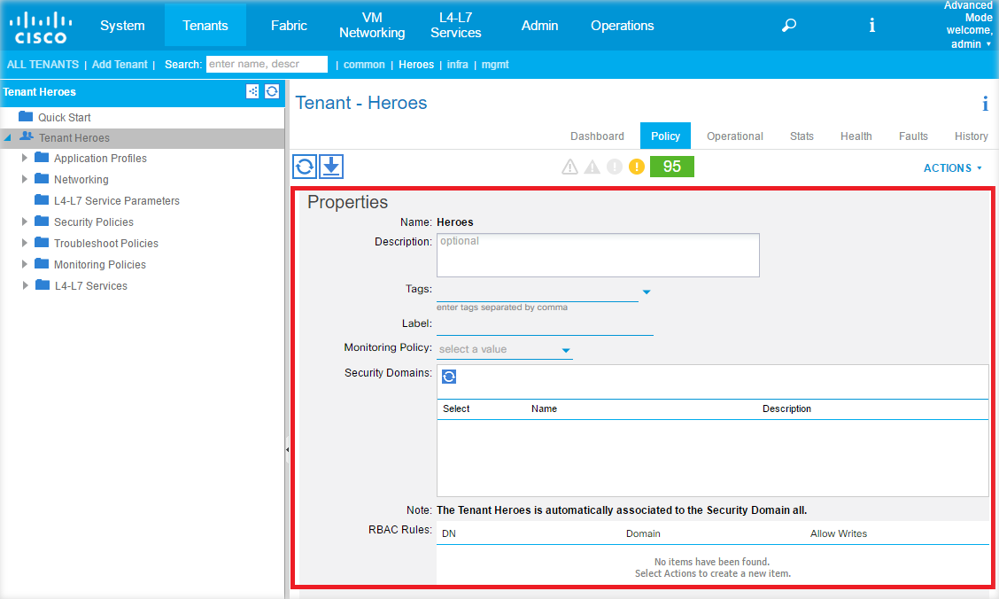
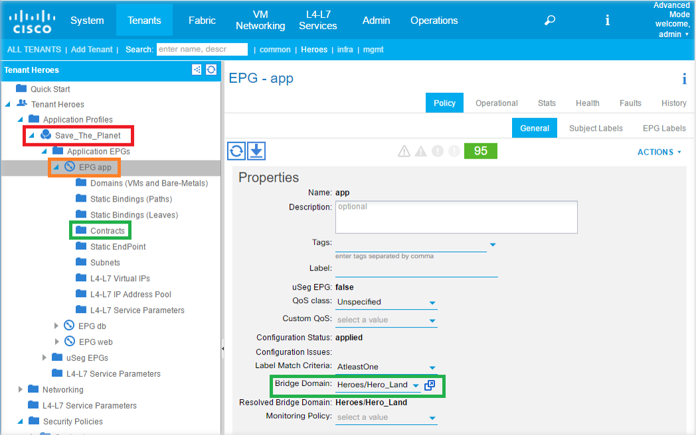
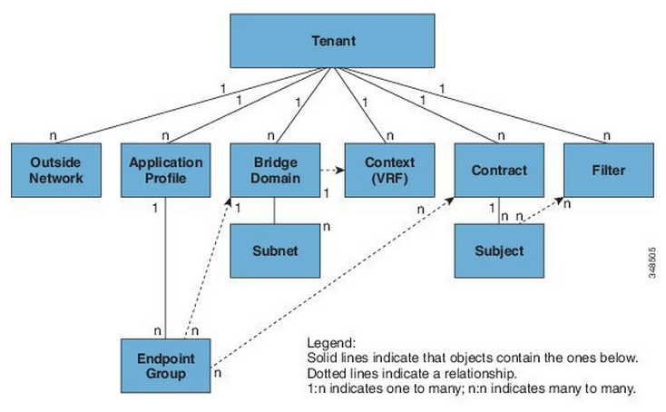
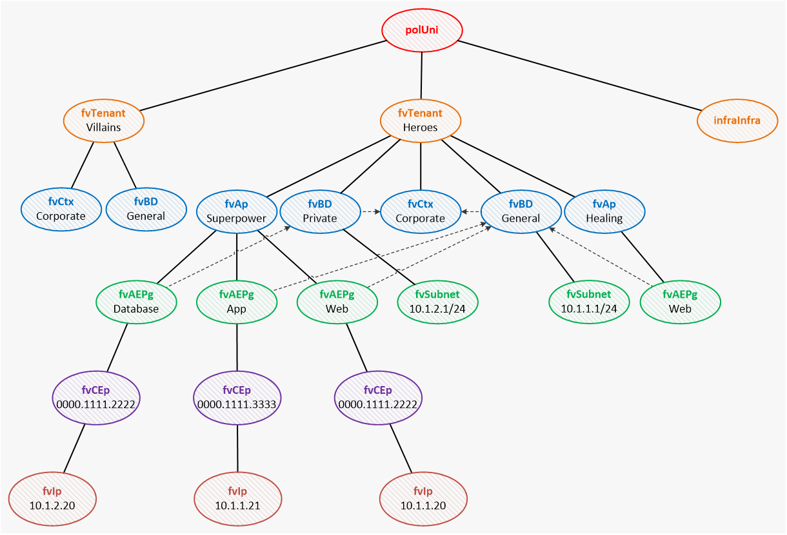
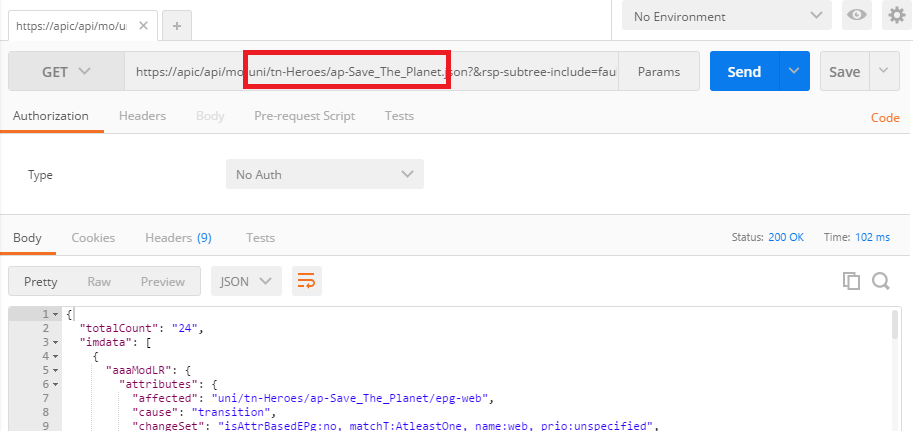

# ACI Programmability Options
Before we take look at the programmability options of ACI, let's review the current state of network programmabliity, or lack thereof.

Networks have traditionally been built with devices designed to be configured and maintained on a per device basis. To make changes or troubleshoot, a network engineer must connect to multiple devices individually and enter commands on the CLI, an interface that was built to be consumed by humans. This solution works fine for static environments, but does not scale and is prone to human error as changes are made more frequently and repetitively.  Since the CLI was built for humans, it is also a less than ideal interface for programmability and automation.

This is the core problem ACI solves for data center operations.  ACI has a robust and diverse set of programmability options and this is made possible due to the ACI Object Model.

### The Object Model
In "Understanding ACI," it was stated that ACI operates using an object-based model, which is used to configure and view statistical data. Before looking at programmatic methods of interacting with ACI, you must have a foundational understanding of how this object-model works. The object model can be divided into two catagories: the logical and concrete.

Administrators and management tools interact with the logical model through the Application Policy Infrastructure Controller (APIC). Changes made to the logical model are pushed down to the concrete model where the hardware and software are programmed as needed. Separating the logical and concrete creates a single management interface to define desired states, instead of managing the network on a per device basis, which helps to simplify programming and automation stratagies.
>Example: An admin creates an EPG and assigns it VLAN 10. The Admin is working with the logical model. The logical model then pushes VLAN 10 to the concrete model by configuring VLAN 10 only on the switches that have hosts in the EPG.

Since Admins work in the logical model, we will spend our time discussing how this model works. The logical model is organized as a hierarchy of objects, with "root" being the top-level object.

#### Managed Objects
For better or worse, everything within an ACI fabric is an object. These objects are called Managed objects, and frequently referred to as MOs. Each MO belongs to a specific class, which determines what properties it has and how it functions. One of the functions of a Tenant object is to restrict adminstrative access to only priveledged accounts; this function would not belong to an object of the Contract class. We can compare the two classes in the APIC GUI

**Tenant Object:**

**Contract Object**

#### Management Information Tree
Managed Objects are connected in parent/child relationships forming the Management Information Tree, or MIT. Every MO has a parent, except for "Root." The MIT is used to add, remove, or query objects by referencing the object's parents up to Root. Objects can also have relationships outside of the parent/child paradigm. An example is the "app" EPG object being a child of the "Save_The_Planet" App Profile, but also having relationships with Bridge Domain and Contract objects.

Relationships can be 1 to 1, 1 to many, or many to many. The diagram that follows illustrates part of the Tenant tree and highlights the different ways objects can be related.

These relationships are important because they determine what resources are available to the objects contained within the relationship. Here is a concrete example to demonstrate these dependencies.

Here are a few things to note from this diagram:

1.  Objects can be uniquely identified in relation to their parent object.
    *  EPG (fvAEPg) "Web" is used twice, but is unique since they have different parent objects
2.  All IP Addresses (fvIp) in "Heroes" must be unique since both Bridge Domains (fvBD) belong to the same VRF (fvCtx)
3.  MAC Addresses can be duplicated as long as the Endpoints (fvCEp) belong to EPGs related to different Bridge Domains
    *  Superpower/Database/0000.1111.2222 forms a relationship with fvBD "Private"
    *  Superpower/Web/0000.1111.2222 forms a relationship with fvBD "General"
4.  The EPG/Bridge Domain relationship determines what Subnets (fvSubnet) the Endpoints can use
    *  Superpower/Database/0000.1111.2222 must use an IP in 10.1.2.0/24
    *  All other EPGs must use an IP in 10.1.1.0/24

Three things we can glean from this discussion of the MIT as it relates to programming are:

*  Configurational and Statistical data is accessed by referencing the Managed Object
*  Objects are accessed/created by starting at "Root" and working down the tree to the unique object
*  Programs need to take into account relationships between objects
    -  What arguments should be included when a function or program is used?
        +  EX: Creating an EPG requires the Tenant and Application objects in order to correctly place it in the MIT, and requires a Bridge Domain to connect the Endpoints to the correct Subnets and VRF.
    -  What tests should be performed before deleting an object?
        +  EX: Before deleting a Bridge Domain, check to see if any EPGs have a relationship with the BD.

#### Relative Names
Each MO has **Relative Name (RN)**, which identifies an object from other child objects of the same parent. Although each RN must be unique within the parent object, they can be duplicated in another parent.

A Relative Name begins with a **class prefix**, and is based off the object's class type. The last part of the RN comes from the **property identefier** that the class uses to identify an object; typicaly the "name" property. The EPG prefix is "epg-" and the property identifier is "name." Looking at the above tree diagram, both "Web" EPGs would have the same RN, "epg-Web." Here is a table of commonly used prefixes and property IDs:

| **Common Name** | **Module** | **Class** | **Prefix-Property** | **Parent** **Class** | **Example** |
| ----------- | ------ | ----- | --------------- | ------------ | ------- |
| Tenant | fv | Tenant | tn-name | Uni | tn-Heroes |
| Context/VRF | fv | Ctx | ctx-name | Tenant | ctx-Corporate |
| Bridge Domain | fv | BD | BD-name | Tenant | BD-General |
| Subnet | fv | Subnet | subnet-ip | BD | subnet-10.1.2.1/24 |
| App Profile | fv | Ap | ap-name | Tenant | ap-Superpower |
| EPG | fv | AEPg | epg-name | Ap | epg-Database |
| Client Endpoint | fv | CEp | cep-name | AEPg | cep-0000.1111.2222 |
| IP Address | fv | Ip | ip-addr | CEp | ip-10.1.2.20 |
| L3 External | l3ext | Out | out-name | Tenant | out-Corporate |
| Filter | vz | Filter | flt-name | Tenant | flt-HTTP |
| Contract | vz | BrCP | brc-name | Tenant | brc-Web_Services |
| Contract Subject | vz | Subj | subj-name | BrCP | subj-HTTP |

RNs can be used to access an object if you are currently located under the parent object. They are frequently used to filter the results of API queries.
>EX: An application owner reports issues with a particular host; in order to look into the issue, a network admin can query the fvCEp Class and return only the objects with a child fvIp of 10.1.1.20 (ip-10.1.1.20).

#### Distinguished Names
We noted in the MIT that an object can be identified by referencing their parent object; we call this an object's **Distinguished Name (DN)**. By definitition, every object in the MIT has a unique DN.

The Distinguished Name consists of a series of RNs starting with root and attaching each child RN down to the object: dn = root/{rn}/{rn}/{rn}. We found that two of the EPGs in our tree have the same RN, however their DNs are distinct:

*  uni/tn-Heroes/**ap-Save_The_Planet**/epg-Web
*  uni/tn-Heroes/**ap-Healing**/epg-Web

Usually you start with an object's ID and need to build the DN in reverse.
Here is an example of creating a new Application named "Havoc" in the "Villains" Tenant.

1.  Build the object RN: **ap-Havoc**
2.  Add each successive parent object up to root:
    *  The parent object of fvAp is fvTenant: **tn-Villains**/ap-Havoc
    *  The parent of fvTenant is the root: **uni**/tn-Villains/ap-Havoc
3.  The full  DN is **uni/tn-Villains/ap-Havoc**

Another example is to find the Endpoints associated with the "Web" EPG. There are multiple "Web" EPGs, so building the proper DN is critical to getting the correct results. For this example, the application is "Superpower."

1.  The object RN is **epg-Web**
2.  Recursively build the parent objects to root:
    *  fvAp is the parent class, and "Superpower" is the specific fvAp object: **ap-Superpower**/epg-Web
    *  fvTenant is the next parent class, and "Heroes" is the specefic  fvTenant object: **tn-Heroes**/ap-Superpower/epg-Web
    *  Root is the parent of fvTenant: **uni**/tn-Heroes/ap-Superpower/epg-Web
3.  The full DN is **uni/tn-Heroes/ap-Superpower/epg-Web**

Distinguished Names are used to make API requests for a specific object.
>EX: To view the faults and log data for the Application "Save_The_Planet," the API request uses the unique DN, "uni/tn-Heroes/ap-Save_The_Planet," as part of the request URL.

Now that we have an overview of the object model, let's take a look at the various ACI programmability options that exist.
