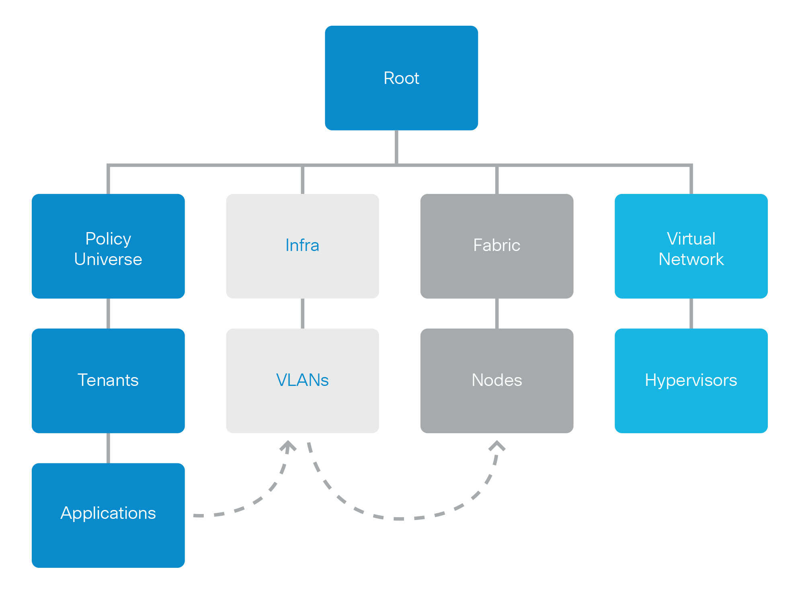

# ACI Programmability Options

Before we take look at the programmability options of ACI, let's review the current state of network programmabliity, or lack thereof.

Networks have traditionally been built with devices designed to be configured and maintained on a per device basis. To make changes or troubleshoot, a network engineer must connect to multiple devices individually and enter commands on the CLI, an interface that was built to be consumed by humans. This solution works fine for static environments, but does not scale and is prone to human error as changes are made more frequently and repetitively.  Since the CLI was built for humans, it is also a less than ideal interface for programmability and automation.

This is the core problem ACI solves for data center operations.  ACI has a robust and diverse set of programmability options and this is made possible due to the ACI Object Model.

## The Object Model
In "Understanding ACI in 15 Minutes," it was stated that ACI operates using an object-based model, which is used to configure and view statistical data. Before looking at programmatic methods of interacting with ACI, you must have a foundational understanding of how this object-model works.

### Managed Objects
For better or worse, everything within an ACI fabric is an object. These objects are called Managed objects, and frequently referred to as MOs.

### Management Information Tee
Managed Objects are connected in parent/child relationships forming the Management Information Tree, or MIT. Every MO has a parent, except for "Root." The MIT is used to add, remove, or query objects by referencing the object's parents up to Root. Objects can also have relationships outside of the parent/child paradigm. An example is the End Point Group (EPG) object being a child of an Application Profile, but also having relationships with the Bridge Domain and Contract objects. These relationships can be 1 to 1, 1 to many, or many to many. The diagram that follows illustrates part of the Tenant tree and highlights the different ways objects can be related.

### Object Names
An object can be identified by its distinguished name (DN) or by its relative name (RN). The RN identifies an object from its siblings within the context of its parent object. RNs can be used to access an object if you are currently located under the parent object. The DN will contain a sequence of RNs.

The Distinguished Name (DN) enables you to unambiguously identify a specific target object. The DN consists of a series of RNs: dn = {rn}/{rn}/{rn}/{rn}... In this example, the DN provides a fully qualified path for an EPG named "web" which belongs to the Application "Save_The_Planet" inside tenant "Heroes." The DN specifies the exact managed object on which the API call is operating: dn = "uni/tn-Heroes/ap-Save_The_Planet/epg-web"

Now that we have an overview of the object model, let's take a look at the various ACI programmability options that exist.
