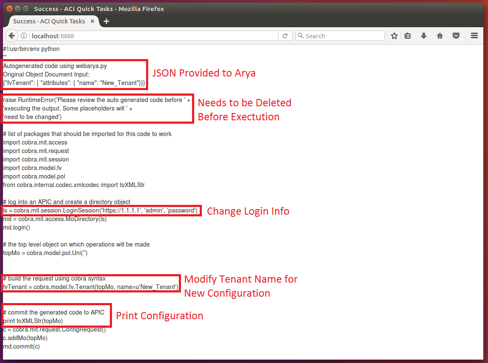
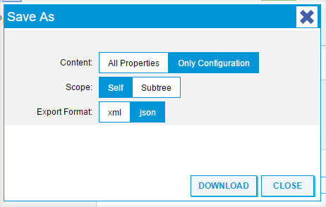
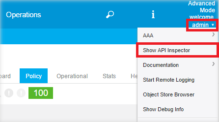
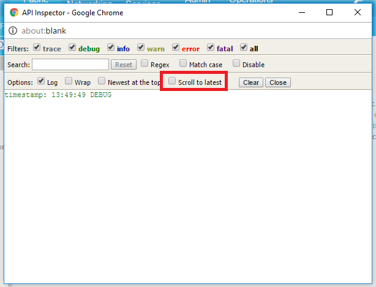
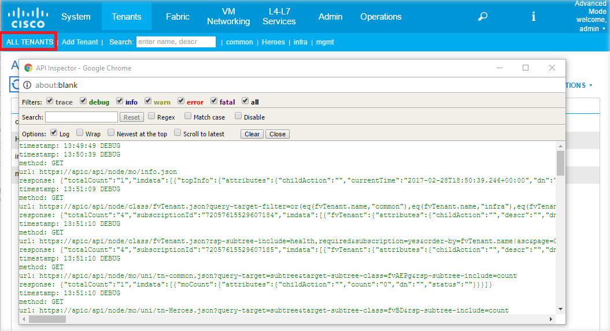
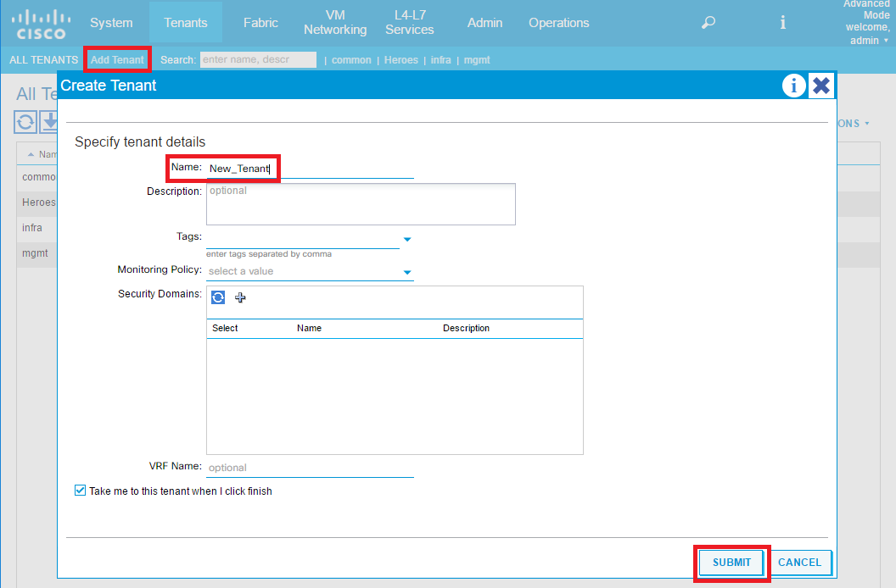
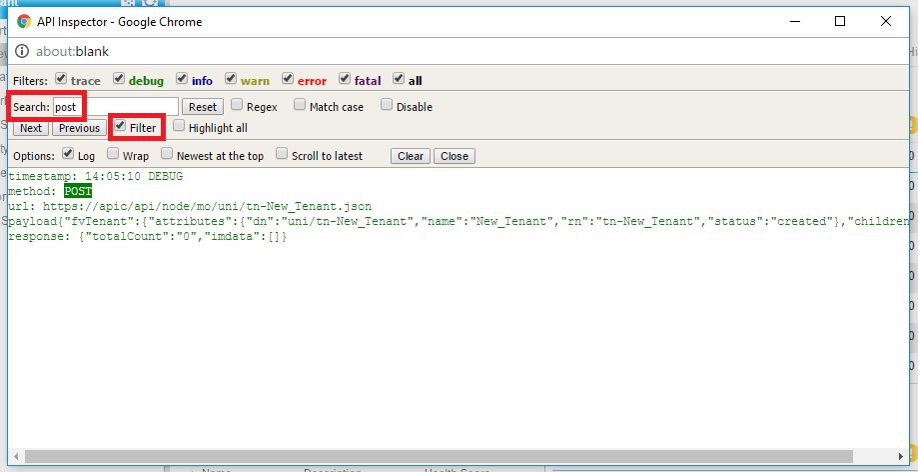

### ACI Programmability Aids
It was previously stated that the Cobra libraries were more complex than using the Toolkit library; fortunately Cisco provides some tools to help administrators easily overcome this. 

#### Arya - Simplifying Cobra's Complexity
Arya, the **A**PIC **R**est p**Y**thon **A**dapter, will asist with generating a Python Script that uses the Cobra libraries. Arya takes either XML or JSON configuration data as inputs and outputs the Python code that would be used to generate the same configuration.  Yes, Arya does in fact auto-generate code for you!


You should always review the script for accuracy and make any changes that are required. You will likely need to change the APICs URL, Username, and Password that the script uses to establish a connection with the APIC. Also, if you submitted XML or JSON of an existing configuration, then you will need to change the necessary configuration parameters for the new object.

The JSON representation of the "New_Tenant" created using both Toolkit and Cobra is:
```json
{
    "fvTenant": {
        "attributes": {
            "name": "New_Tenant"
        }
    }
}
```

Using this JSON, WebArya returns the following Cobra:



The Cobra that Arya returned looks very similar to Cobra that was used above. Thhree minor differences are:

1. Arya adds a comment with the JSON used to generate the code
2. Arya has a reminder to review the code before executing it
3. Arya prints the configuration to XML before committing it to the APIC

The "Webarya" lab provides installation instructions, and has you use Arya in more detail.

#### Configuration Downloads
It is great that Arya provides an easy way to build Cobra Scripts, but it might seem overwhelming to start writing large XML or JSON configuration files. Luckily ACI provides two easy ways to obtain existing configurations in XML or JSON.

##### GUI Downloads
The first method that is availble for configuration downloads is by exporting an object's configuration in the APIC GUI. Follow along with these steps to download some sample configurations:

1.  In the APIC GUI, Browse to Tenants:
2.  Double-click on "common"


On the Common Tenant Screen:

1.  Click on Policy
2.  Download the configuration by either:
  * A: Click the down arrow
  * B: Right-click on "Tenant common" and choose "Save as..."


This will open a new window asking you to choose how much of the configuration you would like to download:



1.  Content:
  *  "All Properties" will include the full object-model information for the MO
  *  "Only Configuration" will just download configuration portions of the object, and is sufficient for input into Arya
2.  Scope:  
  *  "Self" is just this particular object
  *  "Subtree" is all child objects of the MO
3.  Export Format
  *  The data can be exported as either XML or JSON, Arya will take either one.

Set the download as "Only Configuration," "Self," and "json" and click "DOWNLOAD."

The configuration JSON looks similar to what we used for Postman and Arya:
```
{
    "totalCount": "1",
    "imdata": [
        {
            "fvTenant": {
                "attributes": {
                    "descr": "",
                    "dn": "uni/tn-common",
                    "name": "common",
                    "ownerKey": "",
                    "ownerTag": ""
                }
            }
        }
    ]
}
```

This is a simple example used for brevity, but usually it is better to download the "Subtree" of an object's configuration. Downloading a child's objects will create a full configuration of an object. As an example, downloading just a Bridge Domain object will provide some basic configurations such as the Bridge Domain name. However, if the child objects were also downloaded, then the script would also configure new Subnets in the Bridge Domain.

##### API Inspector
The API Inspector is another way to get sample JSON configuration data to use as an input into Arya. Instead of downloading existing configuration data, the API Inspector sniffs for API requests being made to the APIC and displays that in a new browser window.

In the GUI, launch the Inspector by started by clicking on the "welcome" dropdown and selecting "Show API Inspector."



This launches the new browser window that displays the API requests being made. In that window, uncheck "Scroll to latest" to prevent the logs from auto-scrolling.



Navigating around in the APIC will generate GET requests that will be captured by the API Inspector. Click on "ALL TENANTS" in the GUI to generate logs in the Inspector.



Making new configurations in the GUI will generate POST requests that will be captured by the API Inspector. Go ahead and add a new Tenant named "New_Tenant" in the GUI.

1.  Click Add Tenant
2.  Name it "New_Tenant"
3.  Click SUBMIT



Since we unchecked "Scroll to latest" in the API Inspector, we will have to search for the POST request; in the Search bar type "post" and check the "filter" option to only show matching requests.



The log message reads:
```
method: POST
url: https://apic/api/node/mo/uni/tn-New_Tenant.json
payload{"fvTenant":{"attributes":{"dn":"uni/tn-New_Tenant","name":"New_Tenant","rn":"tn-New_Tenant","status":"created"},"children":[]}}
response: {"totalCount":"0","imdata":[]}
```

The payload data looks similar to the downloaded configuration from the "common" Tenant. Unlike the XML/JSON download feature, the API Inspector also provides the URL in addition to the configuration data. This is the exact URL that you would use when using an API tool like Postman. The URL is also included with GET requests, which can be very helpful when trying to query a very specific object that requires a more complex filter string.

The API Inspector offers several other options to help you find the requests you are looking for. A few of the more useful ones are:

*  "Clear" which clears the logs from the browser window
*  "Wrap" for wrapping the log messages to fit within the window
*  "Newest at the top" reverses the order messages are displayed, so the most recent requests are on top

ACI offers several options for interacting with the API. The most commonly used resources are Postman, ACI Toolkit, and Cobra. The Toolkit is easier to get started with than Cobra, but Cobra comes with several tools to aid in generating code.