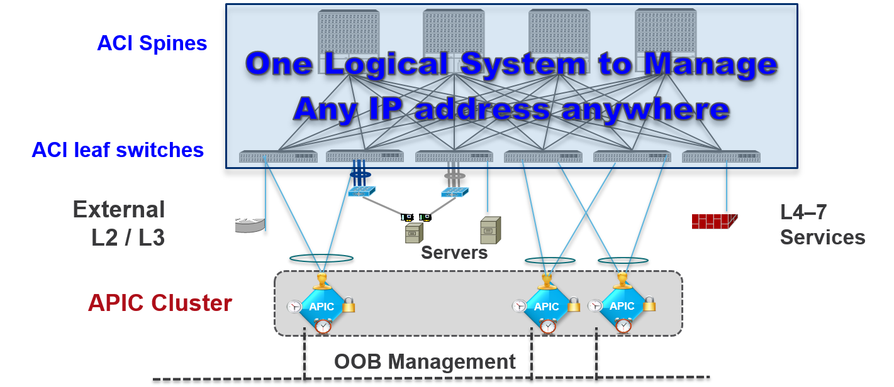

## Diving Deeper into ACI

The Nexus switches running in ACI mode are only programmable via an object-based Policy Engine operating in the APIC controller. The controller is now an integrated part of the network, and holds the profiles containing the policies for programming the switches centrally. The switches themselves do not maintain a CLI configuration file as previously used in NXOS based systems. Everything within an ACI fabric is an object. 

The configuration is held on the APIC and is an object-oriented schema represented using either XML or JSON and stored in a profile to implement application-, network-, and security-driven policies. 

### ACI Components

The core components of an ACI deployment include the following:

*  **Leaf Switches** – The leaf switches provide connectivity into the Fabric at the ToR or EoR. Bandwidth options are available from 100M to 40G for connected devices, with 40G and 100G uplinks to the spines. A combination of Merchant and Custom silicon is utilized. Leaf switches serve as distributed layer 3 gateways, the policy enforcement points, and gateways into external networks. To achieve high degrees of scale, utilization of expensive memory resources (i.e. TCAM) required may be effectively limited to the applications and endpoints locally pertinent to each individual leaf.
*  **Border Leaf Switches** – The border leaf is any leaf node that connects to a network device that is not part of the ACI fabric, such as firewalls, load balancers, routers, or non ACI switches(allows a smooth migration to an ACI network).
*  **Spine Switches** – These switches utilize 40 or 100 Gigabit Ethernet to provide a non-blocking fabric with rapid failure detection and re-routing. Spine switches aggregate data such as the location of endpoints across the fabric, and can serve to forward traffic to remote devices that were previously unknown to a leaf switch. Beginning with Software version 2.0(2), ACI supports Layer 3 connections with EVPN to the spine switches.
*  **APIC Controllers** – APICs provide the centralized point of management for fabric configuration and observing the summary operational state. It is implemented using a distributed framework across a cluster of appliances. From a policy perspective, the APIC is the primary point of contact for configuration and acts as the policy repository.
