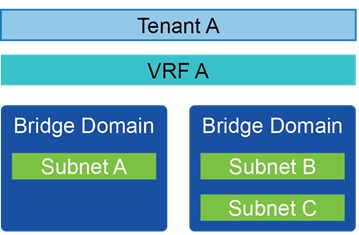
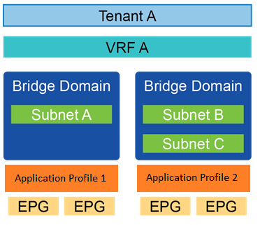

### ACI Terminology

It was previously mentioned that the APICs operate using an object-based Policy Engine; this enables the network administrator to define desired states of the fabric, but leave the implementation up to the controller (APIC). As workloads move, the controller re-configures the underlying infrastructure to ensure the necessary policies are still in place for the end hosts. The branch of the object-model these policies are defined under is the **Tenant** object, and this is where most of the day-to-day operations exist.

#### ACI Tenants

Tenants are a top level object that helps identify and separate administrative control, network/failure domains, and application policies. A Tenant's sub-level objects can be grouped into two basic categories: Tenant Networking and Tenant Policy. These two categories do have inherent relationships, but it can be helpful to discuss them separately. A Tenants Network level objects consist of:

##### Tenant Networking

*  VRFs, also named Contexts and Private Networks. This is an isolated routing table for the Tenant. A Tenant can have one or many VRFs, or could use a VRF from a special Tenant named _common_ . Having each Tenant utilize its own VRF allows network isolation, which will also help with limiting the network’s failure domain.
*  Bridge Domains are the Layer 2 forwarding domain within the fabric, and defines the unique MAC address space and flooding domain (Broadcast, Unknown Unicast, and Multicast). Each Bridge Domain is associated with only one VRF, however a VRF can be associated with many Bridge Domains. Unlike how VLANs have been traditionally deployed, each Bridge Domain can contain multiple subnets. Instead of having to create and deploy new Layer 2 networks, new IP spaces can easily and rapidly be deployed within the existing Bridge Domain. Also unlike VLANs, Bridge Domains are automatically deployed to every switch where hosts within the network are connected. There is no longer a need to create new VLANs and extend them across trunk ports.
*  Subnets are the Layer 3 networks that provide IP space and gateway services for hosts to connect to the network. Each subnet is associated with only 1 Bridge Domain. Hosts in a given subnet will need to be associated with that Bridge Domain, which is discussed further under Tenant Policy. 

Before moving onto discussing the Tenant Policy, it is important to briefly discuss some key distinctions from ACI's networking constructs to how network's have traditionally been deployed. 

For many years, it has been the case that each subnet is associated with a particular VLAN. Security, QoS, and L4-L7 policies are determined by what IP Address is assigned to the host, and therefore a host's VLAN configuration.

ACI can be used similarly to the network centric implementation, but a more application centric approach will breakdown this coupling of the Layer 2 encapsulation with the Layer 3 domain. In a more application centric configuration, a host will belong to a Bridge Domain, which only defines the Layer 2 flooding and available IP space. The Layer 2 encapsulation (VLAN, VXLAN, NVGRE) will determine the security, QoS, and L4-L7 policies, but is completely unrelated to the Bridge Domain.

As an example, Bridge Domain "ABC" might be configured with five subnets. Hosts connected to this Bridge Domain are free to use any available IP address in any of the five subnets. Although there are only five subnets assigned, there might be hundreds of VLAN/VXLAN/NVGRE encapsulations associated with these hosts. When the 5 subnets are used up, all that is required to add more addresses is to add a new subnet in the Bridge Domain; there is no VLAN configuration and trunking associated with increasing the IP space.

##### Tenant Policy

The Tenant Policy objects are related to the network objects, but these objects are more focused on the policies and services the endpoints receive. The Tenant Policy consists of Application Profiles, End Point Groups, Contracts, and Filters.  These are all new and ACI specific terms.

*  An Application Profile is a container for End Point Groups (EPGs). The Application Profile is used as an identifier for Applications, and allows for separation of adminstrative privileges and security access in/out of the EPG.  As an example, if you had a 3-Tier application such as web, app, and db, it would be into three separate EPGs
*  An End Point Group (EPG) is a collection of endpoints that have the same services and policies applied. An EPG will define the switchports, virtual switches, and VLAN/VXLAN/NVGRE encapsulations associated with an application service. Each EPG can only be related to one Bridge Domain, so all hosts in the same EPG must use IP addresses within a subnet assigned to the Bridge Domain. If the Bridge Domain is configured with more than one subnet, the hosts can belong to different subnets.
*  Contracts define the services and policies applied to the end points in an EPG. Contracts can be used for service redirection to an L4-L7 device, assign QoS values, and to apply ACL rules. Contracts are formed in a "provide" and "consume" relationship. The EPG that offers the services will provide the contract, and the EPGs that need that service will consume the contract.
*  Filters are the objects that define protocols (tcp, udp, icmp, etc.) and ports. Filter objects can contain multiple protocols and ports, and Contracts can consume multiple Filters.

It is extremely important to understand Tenant Networking and Tenant Policy before you start programming ACI.  Since we've covered these basics, let's now move to looking at the different programability options ACI has to offer.

