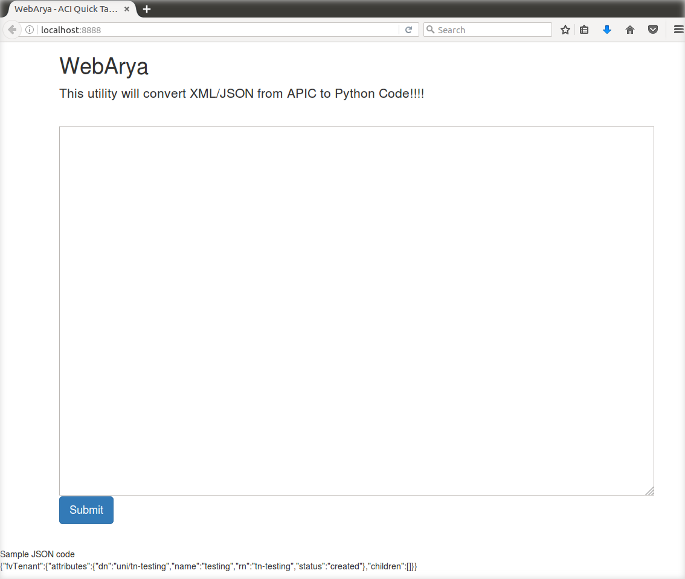
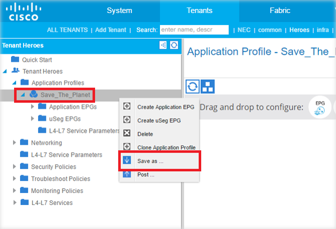
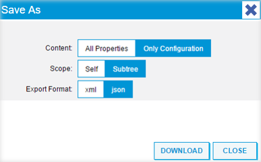
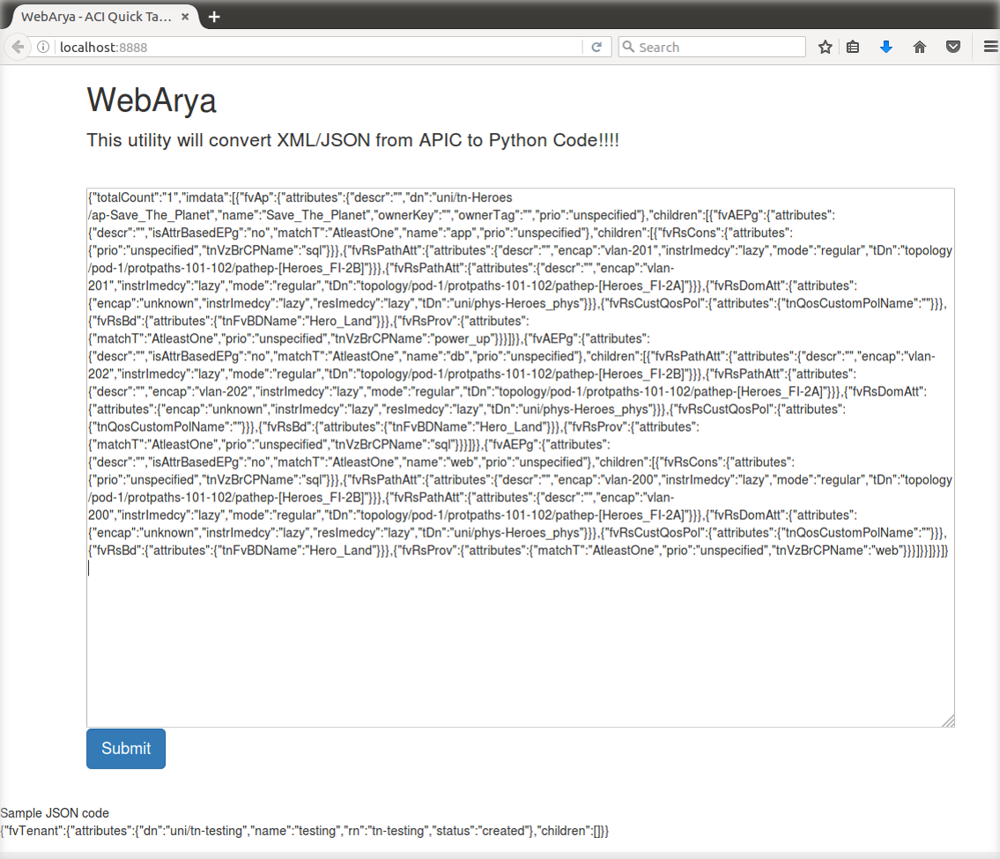
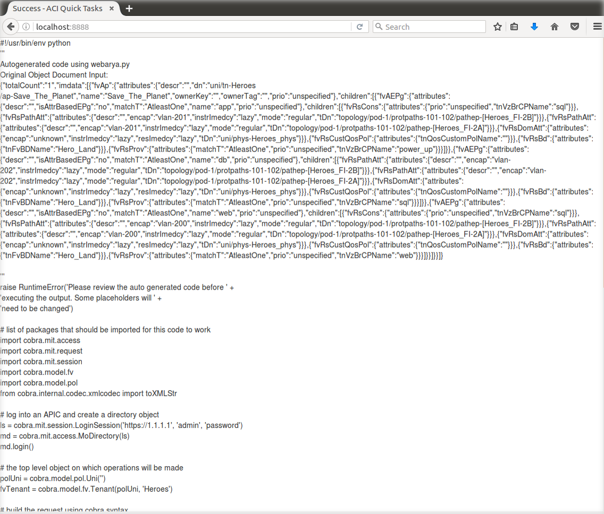
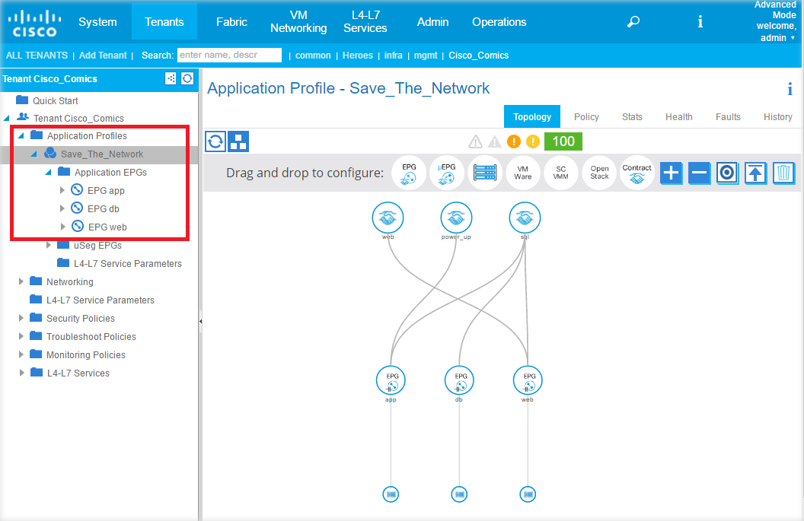

### Use WebArya to build an application
In order to use WebArya, you will need to:

1.  Start the web process
2.  Open the WebArya page
3.  Collect Configuration Data
4.  Use WebArya to get the Python script
5.  Edit the script for new configurations
6.  Execute the python script

#### Run the WebArya program
Webarya should already be started from the previous example excercise; if it was stopped, restart the process by executing webarya.py. 
```bash
$ cd directory/path/before/webarya/webarya/webarya
$ ls
hello.py  __init__.py  README.md  static  templates  webarya.py
$ python webarya.py
 * Running on http://0.0.0.0:8888/ (Press CTRL+C to quit)
 * Restarting with stat
 * Debugger is active!
 * Debugger pin code: 102-464-421
```

#### Lauch the WebArya Page
If the webarya page is not already loaded, open your browser to `http://localhost:8888`.



#### Getting Sample Configuration Data
With WebArya working, the next task is to export sample configurations from exisiting objects in the APIC. This portion of the lab will guide you through downloading an application configuration that will be used as a template for building an application for the "Cisco_Comics" Tenant created in the ACIToolkit lab.
>This lab will build also build the "Cisco_Comics" Tenant if it does not exist.

##### Download an Application's Configuration
The ACI fabric is already configured with a Tenant named Heroes. Inside this Tenant is an application called `Save_The_Planet`, which you can use to download an application's configuration.

In the APIC GUI, browse to the Heroes Tenant and download the Save_The_Planet configuration:

1. Click on Tenants on the top menu bar and choose the Heroes Tenant
  *  The left-hand menu bar populates with the objects related to the Heroes Tenant
2. Click on the arrow next to `Application Profiles` to expand its child objects
  *  The application `Save_The_Planet` is underneath the `Application Profiles` folder
3. Right-click on the `Save_The_Planet` application and choose `Save as...`



A new box should pop up with the download options

1. Select the follwing options:  
  1. Only Configuration  
  2. Subtree
  3. JSON
2. Click DOWNLOAD



#### Using WebArya
Now that you have some configuration data, you are ready to use WebArya to get a Cobra script.

##### Copy the Sample Configuration
Open the file you just downloaded and copy all of the contents to the main WebArya page opened in the first step.
```json
{"totalCount":"1","imdata":[{"fvAp":{"attributes":{"descr":"","dn":"uni/tn-Heroes/ap-Save_The_Planet","name":"Save_The_Planet","ownerKey":"","ownerTag":"","prio":"unspecified"},"children":[{"fvAEPg":{"attributes":{"descr":"","isAttrBasedEPg":"no","matchT":"AtleastOne","name":"app","prio":"unspecified"},"children":[{"fvRsCons":{"attributes":{"prio":"unspecified","tnVzBrCPName":"sql"}}},{"fvRsPathAtt":{"attributes":{"descr":"","encap":"vlan-201","instrImedcy":"lazy","mode":"regular","tDn":"topology/pod-1/protpaths-101-102/pathep-[Heroes_FI-2B]"}}},{"fvRsPathAtt":{"attributes":{"descr":"","encap":"vlan-201","instrImedcy":"lazy","mode":"regular","tDn":"topology/pod-1/protpaths-101-102/pathep-[Heroes_FI-2A]"}}},{"fvRsDomAtt":{"attributes":{"encap":"unknown","instrImedcy":"lazy","resImedcy":"lazy","tDn":"uni/phys-Heroes_phys"}}},{"fvRsCustQosPol":{"attributes":{"tnQosCustomPolName":""}}},{"fvRsBd":{"attributes":{"tnFvBDName":"Hero_Land"}}},{"fvRsProv":{"attributes":{"matchT":"AtleastOne","prio":"unspecified","tnVzBrCPName":"power_up"}}}]}},{"fvAEPg":{"attributes":{"descr":"","isAttrBasedEPg":"no","matchT":"AtleastOne","name":"db","prio":"unspecified"},"children":[{"fvRsPathAtt":{"attributes":{"descr":"","encap":"vlan-202","instrImedcy":"lazy","mode":"regular","tDn":"topology/pod-1/protpaths-101-102/pathep-[Heroes_FI-2B]"}}},{"fvRsPathAtt":{"attributes":{"descr":"","encap":"vlan-202","instrImedcy":"lazy","mode":"regular","tDn":"topology/pod-1/protpaths-101-102/pathep-[Heroes_FI-2A]"}}},{"fvRsDomAtt":{"attributes":{"encap":"unknown","instrImedcy":"lazy","resImedcy":"lazy","tDn":"uni/phys-Heroes_phys"}}},{"fvRsCustQosPol":{"attributes":{"tnQosCustomPolName":""}}},{"fvRsBd":{"attributes":{"tnFvBDName":"Hero_Land"}}},{"fvRsProv":{"attributes":{"matchT":"AtleastOne","prio":"unspecified","tnVzBrCPName":"sql"}}}]}},{"fvAEPg":{"attributes":{"descr":"","isAttrBasedEPg":"no","matchT":"AtleastOne","name":"web","prio":"unspecified"},"children":[{"fvRsCons":{"attributes":{"prio":"unspecified","tnVzBrCPName":"sql"}}},{"fvRsPathAtt":{"attributes":{"descr":"","encap":"vlan-200","instrImedcy":"lazy","mode":"regular","tDn":"topology/pod-1/protpaths-101-102/pathep-[Heroes_FI-2B]"}}},{"fvRsPathAtt":{"attributes":{"descr":"","encap":"vlan-200","instrImedcy":"lazy","mode":"regular","tDn":"topology/pod-1/protpaths-101-102/pathep-[Heroes_FI-2A]"}}},{"fvRsDomAtt":{"attributes":{"encap":"unknown","instrImedcy":"lazy","resImedcy":"lazy","tDn":"uni/phys-Heroes_phys"}}},{"fvRsCustQosPol":{"attributes":{"tnQosCustomPolName":""}}},{"fvRsBd":{"attributes":{"tnFvBDName":"Hero_Land"}}},{"fvRsProv":{"attributes":{"matchT":"AtleastOne","prio":"unspecified","tnVzBrCPName":"web"}}}]}}]}}]}
```

This configuration file is saved as ap-Save_The_Planet-conifg.json in the repo.



Click `Submit` at the bottom of the WebArya page to return the Cobra output.



```python
#!/usr/bin/env python
'''
Autogenerated code using webarya.py
Original Object Document Input:
{"totalCount":"1","imdata":[{"fvAp":{"attributes":{"descr":"","dn":"uni/tn-Heroes/ap-Save_The_Planet","name":"Save_The_Planet","ownerKey":"","ownerTag":"","prio":"unspecified"},"children":[{"fvAEPg":{"attributes":{"descr":"","isAttrBasedEPg":"no","matchT":"AtleastOne","name":"app","prio":"unspecified"},"children":[{"fvRsCons":{"attributes":{"prio":"unspecified","tnVzBrCPName":"sql"}}},{"fvRsPathAtt":{"attributes":{"descr":"","encap":"vlan-201","instrImedcy":"lazy","mode":"regular","tDn":"topology/pod-1/protpaths-101-102/pathep-[Heroes_FI-2B]"}}},{"fvRsPathAtt":{"attributes":{"descr":"","encap":"vlan-201","instrImedcy":"lazy","mode":"regular","tDn":"topology/pod-1/protpaths-101-102/pathep-[Heroes_FI-2A]"}}},{"fvRsDomAtt":{"attributes":{"encap":"unknown","instrImedcy":"lazy","resImedcy":"lazy","tDn":"uni/phys-Heroes_phys"}}},{"fvRsCustQosPol":{"attributes":{"tnQosCustomPolName":""}}},{"fvRsBd":{"attributes":{"tnFvBDName":"Hero_Land"}}},{"fvRsProv":{"attributes":{"matchT":"AtleastOne","prio":"unspecified","tnVzBrCPName":"power_up"}}}]}},{"fvAEPg":{"attributes":{"descr":"","isAttrBasedEPg":"no","matchT":"AtleastOne","name":"db","prio":"unspecified"},"children":[{"fvRsPathAtt":{"attributes":{"descr":"","encap":"vlan-202","instrImedcy":"lazy","mode":"regular","tDn":"topology/pod-1/protpaths-101-102/pathep-[Heroes_FI-2B]"}}},{"fvRsPathAtt":{"attributes":{"descr":"","encap":"vlan-202","instrImedcy":"lazy","mode":"regular","tDn":"topology/pod-1/protpaths-101-102/pathep-[Heroes_FI-2A]"}}},{"fvRsDomAtt":{"attributes":{"encap":"unknown","instrImedcy":"lazy","resImedcy":"lazy","tDn":"uni/phys-Heroes_phys"}}},{"fvRsCustQosPol":{"attributes":{"tnQosCustomPolName":""}}},{"fvRsBd":{"attributes":{"tnFvBDName":"Hero_Land"}}},{"fvRsProv":{"attributes":{"matchT":"AtleastOne","prio":"unspecified","tnVzBrCPName":"sql"}}}]}},{"fvAEPg":{"attributes":{"descr":"","isAttrBasedEPg":"no","matchT":"AtleastOne","name":"web","prio":"unspecified"},"children":[{"fvRsCons":{"attributes":{"prio":"unspecified","tnVzBrCPName":"sql"}}},{"fvRsPathAtt":{"attributes":{"descr":"","encap":"vlan-200","instrImedcy":"lazy","mode":"regular","tDn":"topology/pod-1/protpaths-101-102/pathep-[Heroes_FI-2B]"}}},{"fvRsPathAtt":{"attributes":{"descr":"","encap":"vlan-200","instrImedcy":"lazy","mode":"regular","tDn":"topology/pod-1/protpaths-101-102/pathep-[Heroes_FI-2A]"}}},{"fvRsDomAtt":{"attributes":{"encap":"unknown","instrImedcy":"lazy","resImedcy":"lazy","tDn":"uni/phys-Heroes_phys"}}},{"fvRsCustQosPol":{"attributes":{"tnQosCustomPolName":""}}},{"fvRsBd":{"attributes":{"tnFvBDName":"Hero_Land"}}},{"fvRsProv":{"attributes":{"matchT":"AtleastOne","prio":"unspecified","tnVzBrCPName":"web"}}}]}}]}}]}

'''
raise RuntimeError('Please review the auto generated code before ' +
'executing the output. Some placeholders will ' +
'need to be changed')

# list of packages that should be imported for this code to work
import cobra.mit.access
import cobra.mit.request
import cobra.mit.session
import cobra.model.fv
import cobra.model.pol
from cobra.internal.codec.xmlcodec import toXMLStr

# log into an APIC and create a directory object
ls = cobra.mit.session.LoginSession('https://1.1.1.1', 'admin', 'password')
md = cobra.mit.access.MoDirectory(ls)
md.login()

# the top level object on which operations will be made
polUni = cobra.model.pol.Uni('')
fvTenant = cobra.model.fv.Tenant(polUni, 'Heroes')

# build the request using cobra syntax
fvAp = cobra.model.fv.Ap(fvTenant, ownerKey=u'', name=u'Save_The_Planet', prio=u'unspecified', ownerTag=u'', descr=u'')
fvAEPg = cobra.model.fv.AEPg(fvAp, isAttrBasedEPg=u'no', matchT=u'AtleastOne', prio=u'unspecified', name=u'app', descr=u'')
fvRsCons = cobra.model.fv.RsCons(fvAEPg, tnVzBrCPName=u'sql', prio=u'unspecified')
fvRsPathAtt = cobra.model.fv.RsPathAtt(fvAEPg, tDn=u'topology/pod-1/protpaths-101-102/pathep-[Heroes_FI-2B]', instrImedcy=u'lazy', encap=u'vlan-201', descr=u'', mode=u'regular')
fvRsPathAtt2 = cobra.model.fv.RsPathAtt(fvAEPg, tDn=u'topology/pod-1/protpaths-101-102/pathep-[Heroes_FI-2A]', instrImedcy=u'lazy', encap=u'vlan-201', descr=u'', mode=u'regular')
fvRsDomAtt = cobra.model.fv.RsDomAtt(fvAEPg, instrImedcy=u'lazy', resImedcy=u'lazy', encap=u'unknown', tDn=u'uni/phys-Heroes_phys')
fvRsCustQosPol = cobra.model.fv.RsCustQosPol(fvAEPg, tnQosCustomPolName=u'')
fvRsBd = cobra.model.fv.RsBd(fvAEPg, tnFvBDName=u'Hero_Land')
fvRsProv = cobra.model.fv.RsProv(fvAEPg, tnVzBrCPName=u'power_up', matchT=u'AtleastOne', prio=u'unspecified')
fvAEPg2 = cobra.model.fv.AEPg(fvAp, isAttrBasedEPg=u'no', matchT=u'AtleastOne', prio=u'unspecified', name=u'db', descr=u'')
fvRsPathAtt3 = cobra.model.fv.RsPathAtt(fvAEPg2, tDn=u'topology/pod-1/protpaths-101-102/pathep-[Heroes_FI-2B]', instrImedcy=u'lazy', encap=u'vlan-202', descr=u'', mode=u'regular')
fvRsPathAtt4 = cobra.model.fv.RsPathAtt(fvAEPg2, tDn=u'topology/pod-1/protpaths-101-102/pathep-[Heroes_FI-2A]', instrImedcy=u'lazy', encap=u'vlan-202', descr=u'', mode=u'regular')
fvRsDomAtt2 = cobra.model.fv.RsDomAtt(fvAEPg2, instrImedcy=u'lazy', resImedcy=u'lazy', encap=u'unknown', tDn=u'uni/phys-Heroes_phys')
fvRsCustQosPol2 = cobra.model.fv.RsCustQosPol(fvAEPg2, tnQosCustomPolName=u'')
fvRsBd2 = cobra.model.fv.RsBd(fvAEPg2, tnFvBDName=u'Hero_Land')
fvRsProv2 = cobra.model.fv.RsProv(fvAEPg2, tnVzBrCPName=u'sql', matchT=u'AtleastOne', prio=u'unspecified')
fvAEPg3 = cobra.model.fv.AEPg(fvAp, isAttrBasedEPg=u'no', matchT=u'AtleastOne', prio=u'unspecified', name=u'web', descr=u'')
fvRsCons2 = cobra.model.fv.RsCons(fvAEPg3, tnVzBrCPName=u'sql', prio=u'unspecified')
fvRsPathAtt5 = cobra.model.fv.RsPathAtt(fvAEPg3, tDn=u'topology/pod-1/protpaths-101-102/pathep-[Heroes_FI-2B]', instrImedcy=u'lazy', encap=u'vlan-200', descr=u'', mode=u'regular')
fvRsPathAtt6 = cobra.model.fv.RsPathAtt(fvAEPg3, tDn=u'topology/pod-1/protpaths-101-102/pathep-[Heroes_FI-2A]', instrImedcy=u'lazy', encap=u'vlan-200', descr=u'', mode=u'regular')
fvRsDomAtt3 = cobra.model.fv.RsDomAtt(fvAEPg3, instrImedcy=u'lazy', resImedcy=u'lazy', encap=u'unknown', tDn=u'uni/phys-Heroes_phys')
fvRsCustQosPol3 = cobra.model.fv.RsCustQosPol(fvAEPg3, tnQosCustomPolName=u'')
fvRsBd3 = cobra.model.fv.RsBd(fvAEPg3, tnFvBDName=u'Hero_Land')
fvRsProv3 = cobra.model.fv.RsProv(fvAEPg3, tnVzBrCPName=u'web', matchT=u'AtleastOne', prio=u'unspecified')


# commit the generated code to APIC
print toXMLStr(fvTenant)
c = cobra.mit.request.ConfigRequest()
c.addMo(fvTenant)
md.commit(c)
```

This script is located in the repo as ap-Save_The_Planet-conifg.py

#### Edit the Sample Script
A few parts of the script will need to be to updated to provide new values for your application. The existing application has three tiers: web, app, and db. The new application will also be a three tier application using the same names. The contracts used by the existing EPGs were created in a special Tenant named `common`, which shares its objects with every other Tenant. The benefit of this is that you can reuse the same contracts in your new application. The items that do need to be changed are: Tenant and Applicaton Name, and the associated Bridge Domain and VLANs.

##### Copy WebArya's oupt to a text editor
The script that WebArya provides should be copied to a text editor and saved as add_application.py. Some editors will format the text for you based on the type of file, which can be helpful when making edits.

##### Looking at the Pre-Code
The first line in the script is the shebang line, it is best practice to leave this line in the script.
```python
#!/usr/bin/env python
```

The block of text in between the triple quotes `'''` is the JSON data that we used as input to Arya. This is useful for documentation when developing scripts, and is recommended to be kept in the script.
```python
'''
Autogenerated code using webarya.py
Original Object Document Input:
{"totalCount":"1","imdata":[{"fvAp":{"attributes":{"descr":"","dn":"uni/tn-Heroes/ap-Save_The_Planet","name":"Save_The_Planet","ownerKey":"","ownerTag":"","prio":"unspecified"},"children":[{"fvAEPg":{"attributes":{"descr":"","isAttrBasedEPg":"no","matchT":"AtleastOne","name":"app","prio":"unspecified"},"children":[{"fvRsCons":{"attributes":{"prio":"unspecified","tnVzBrCPName":"sql"}}},{"fvRsPathAtt":{"attributes":{"descr":"","encap":"vlan-201","instrImedcy":"lazy","mode":"regular","tDn":"topology/pod-1/protpaths-101-102/pathep-[Heroes_FI-2B]"}}},{"fvRsPathAtt":{"attributes":{"descr":"","encap":"vlan-201","instrImedcy":"lazy","mode":"regular","tDn":"topology/pod-1/protpaths-101-102/pathep-[Heroes_FI-2A]"}}},{"fvRsDomAtt":{"attributes":{"encap":"unknown","instrImedcy":"lazy","resImedcy":"lazy","tDn":"uni/phys-Heroes_phys"}}},{"fvRsCustQosPol":{"attributes":{"tnQosCustomPolName":""}}},{"fvRsBd":{"attributes":{"tnFvBDName":"Hero_Land"}}},{"fvRsProv":{"attributes":{"matchT":"AtleastOne","prio":"unspecified","tnVzBrCPName":"power_up"}}}]}},{"fvAEPg":{"attributes":{"descr":"","isAttrBasedEPg":"no","matchT":"AtleastOne","name":"db","prio":"unspecified"},"children":[{"fvRsPathAtt":{"attributes":{"descr":"","encap":"vlan-202","instrImedcy":"lazy","mode":"regular","tDn":"topology/pod-1/protpaths-101-102/pathep-[Heroes_FI-2B]"}}},{"fvRsPathAtt":{"attributes":{"descr":"","encap":"vlan-202","instrImedcy":"lazy","mode":"regular","tDn":"topology/pod-1/protpaths-101-102/pathep-[Heroes_FI-2A]"}}},{"fvRsDomAtt":{"attributes":{"encap":"unknown","instrImedcy":"lazy","resImedcy":"lazy","tDn":"uni/phys-Heroes_phys"}}},{"fvRsCustQosPol":{"attributes":{"tnQosCustomPolName":""}}},{"fvRsBd":{"attributes":{"tnFvBDName":"Hero_Land"}}},{"fvRsProv":{"attributes":{"matchT":"AtleastOne","prio":"unspecified","tnVzBrCPName":"sql"}}}]}},{"fvAEPg":{"attributes":{"descr":"","isAttrBasedEPg":"no","matchT":"AtleastOne","name":"web","prio":"unspecified"},"children":[{"fvRsCons":{"attributes":{"prio":"unspecified","tnVzBrCPName":"sql"}}},{"fvRsPathAtt":{"attributes":{"descr":"","encap":"vlan-200","instrImedcy":"lazy","mode":"regular","tDn":"topology/pod-1/protpaths-101-102/pathep-[Heroes_FI-2B]"}}},{"fvRsPathAtt":{"attributes":{"descr":"","encap":"vlan-200","instrImedcy":"lazy","mode":"regular","tDn":"topology/pod-1/protpaths-101-102/pathep-[Heroes_FI-2A]"}}},{"fvRsDomAtt":{"attributes":{"encap":"unknown","instrImedcy":"lazy","resImedcy":"lazy","tDn":"uni/phys-Heroes_phys"}}},{"fvRsCustQosPol":{"attributes":{"tnQosCustomPolName":""}}},{"fvRsBd":{"attributes":{"tnFvBDName":"Hero_Land"}}},{"fvRsProv":{"attributes":{"matchT":"AtleastOne","prio":"unspecified","tnVzBrCPName":"web"}}}]}}]}}]}

'''
```

The next 3 lines are a reminder to examine the script before execution, and will need to be removed before the program will work. Go ahead and delete these lines.
```python
raise RuntimeError('Please review the auto generated code before ' +
'executing the output. Some placeholders will ' +
'need to be changed')
```

##### Import Statements
The import statements are used to import the necessary libraries for the script to exectute, and should be left as they are.
```python
# list of packages that should be imported for this code to work
import cobra.mit.access
import cobra.mit.request
import cobra.mit.session
import cobra.model.fv
import cobra.model.pol
from cobra.internal.codec.xmlcodec import toXMLStr
```

##### Add Variables to the Script
We recommend adding a section that creates variables for all fields that could be changed to make new configurations, and then replacing the WebArya script with the variable names. The advantage of this is that the script becomes easier to reuse, as you only need to update this portion of script with the new information.
```python
# login variables
>>> url = 'https://apic'
>>> login = 'admin'
>>> password = 'password'
>>> 
# configuration variables
>>> tenant = 'Cisco_Comics'
>>> bridge_domain = 'ACI_Way'
>>> application = 'Save_The_Network'
>>> vlan1 = 'vlan-211'
>>> vlan2 = 'vlan-212'
>>> vlan3 = 'vlan-210'
```

##### Modify the Login URL and Credentials
The LoginSession needs to be changed to provide the correct URL, Username, and Password.
> **The line that needs to be updated is indicated by the `##` with a comment on what needs to be changed.**

```python
# create a login session for connecting to the APIC
## The URL, Username, and Password should be updated with the url, login, and password variables
ls = cobra.mit.session.LoginSession('https://1.1.1.1', 'admin', 'password')
md = cobra.mit.access.MoDirectory(ls)
md.login()
```

##### Change the Tenant object for the new Application
The next block of code establishes the top level objects which represent the MO that changes will be applied to.
> **The line that needs to be updated is indicated by the `##` with a comment on what needs to be changed.**

```python
# the top level object on which operations will be made
polUni = cobra.model.pol.Uni('')

# create an object for an Application's top level object, the Tenant.
## the Tenant name "Heroes" should be changed to the tenant variable
fvTenant = cobra.model.fv.Tenant(polUni, 'Heroes')
```

##### Modify the Application and EPGs
The next major code block is the actual configuration of the Application, `Save_The_Planet`, which needs to have a few fields updated for your new Application, `Save_The_Network`.

The first line of code will create a new Applicaton Profile, which is the parent object for EPGs. Since the three EPGs you will create belong to the same Application; you only need to create one Application object, and each new EPG will reference this Managed Object.
> **This line needs to be changed as indicated by the `##`.**

```python
## the Application name "Save_The_Planet" should be changed to the application variable
fvAp = cobra.model.fv.Ap(fvTenant, ownerKey=u'', name=u'Save_The_Planet', prio=u'unspecified', ownerTag=u'', descr=u'')
```

##### Create the "app" EPG
The first few lines of code can be grouped together as they all relate to the same EPG. The configuration line for creating the new EPG object will not need to be changed since the EPG's name will be the same as the EPG in "Save_The_Planet." Also the EPG is associated to an Application Profile by referencing the object, `fvAP`. As long as that object has been changed, and this was done in the previous step, then the App Profile object will be referencing the new App Profile.
> **Lines that need to be updated will contain a comment beginning with `##`.**

```python
# create the first EPG underneath your new Application.
fvAEPg = cobra.model.fv.AEPg(fvAp, isAttrBasedEPg=u'no', matchT=u'AtleastOne', prio=u'unspecified', name=u'app', descr=u'')

# have the EPG created by the previous line of code consume the "sql" contract.
fvRsCons = cobra.model.fv.RsCons(fvAEPg, tnVzBrCPName=u'sql', prio=u'unspecified')

# assign a VLAN and vPC to the EPG represented by fvAEPg
## the encap should be changed to use the vlan1 variable
fvRsPathAtt = cobra.model.fv.RsPathAtt(fvAEPg, tDn=u'topology/pod-1/protpaths-101-102/pathep-[Heroes_FI-2B]', instrImedcy=u'lazy', encap=u'vlan-201', descr=u'', mode=u'regular')

# assign a VLAN and a second vPC to the EPG represented by fvAEPg 
## the encap should be changed to use the vlan1 variable
fvRsPathAtt2 = cobra.model.fv.RsPathAtt(fvAEPg, tDn=u'topology/pod-1/protpaths-101-102/pathep-[Heroes_FI-2A]', instrImedcy=u'lazy', encap=u'vlan-201', descr=u'', mode=u'regular')

# creates a relationship between the EPG represented by fvAEPg and a Physical Domain.
# this determines what encapsulation values can be used.
fvRsDomAtt = cobra.model.fv.RsDomAtt(fvAEPg, instrImedcy=u'lazy', resImedcy=u'lazy', encap=u'unknown', tDn=u'uni/phys-Heroes_phys')

# sets the QoS policy for the EPG represented by fvAEPg
fvRsCustQosPol = cobra.model.fv.RsCustQosPol(fvAEPg, tnQosCustomPolName=u'')

# this assigns the Bridge Domain that hosts in fvAEPg will belong to. the Bridge 
# Domain provides a flooding domain and a set of subnets the hosts can belong to.
## the Bridge Domain name should be changed from "Hero_Land" to the bridge_domain variable
fvRsBd = cobra.model.fv.RsBd(fvAEPg, tnFvBDName=u'Hero_Land')

# have the EPG represented by the fvAEPg object provide the "power_up" contract
fvRsProv = cobra.model.fv.RsProv(fvAEPg, tnVzBrCPName=u'power_up', matchT=u'AtleastOne', prio=u'unspecified')
```

##### Create the "db" EPG
The Next few lines of code are very similar to the previous block, but each object name is slightly different to create a new instance of the object type.
> **Lines that need to be updated will contain a comment beginning with `##`.**

```python
# creates a new EPG object represented by the name fvAEPg2
fvAEPg2 = cobra.model.fv.AEPg(fvAp, isAttrBasedEPg=u'no', matchT=u'AtleastOne', prio=u'unspecified', name=u'db', descr=u'')

# assign a VLAN and vPC to the EPG represented by fvAEPg2
## the encap should be changed to use the vlan2 variable
fvRsPathAtt3 = cobra.model.fv.RsPathAtt(fvAEPg2, tDn=u'topology/pod-1/protpaths-101-102/pathep-[Heroes_FI-2B]', instrImedcy=u'lazy', encap=u'vlan-202', descr=u'', mode=u'regular')

# assign a VLAN and a second vPC to the EPG represented by fvAEPg2
## the encap should be changed to use the vlan2 variable"
fvRsPathAtt4 = cobra.model.fv.RsPathAtt(fvAEPg2, tDn=u'topology/pod-1/protpaths-101-102/pathep-[Heroes_FI-2A]', instrImedcy=u'lazy', encap=u'vlan-202', descr=u'', mode=u'regular')

# creates a relationship between the EPG represented by fvAEPg2 and a Physical Domain.
fvRsDomAtt2 = cobra.model.fv.RsDomAtt(fvAEPg2, instrImedcy=u'lazy', resImedcy=u'lazy', encap=u'unknown', tDn=u'uni/phys-Heroes_phys')

# sets the QoS policy for the EPG represented by fvAEPg2
fvRsCustQosPol2 = cobra.model.fv.RsCustQosPol(fvAEPg2, tnQosCustomPolName=u'')

# this assigns the Bridge Domain that hosts in the fvAEPg2 will belong to
## the Bridge Domain name should be changed from "Hero_Land" to the bridge_domain variable
fvRsBd2 = cobra.model.fv.RsBd(fvAEPg2, tnFvBDName=u'Hero_Land')

# have the EPG represented by the fvAEPg2 object provide the "sql" contract
fvRsProv2 = cobra.model.fv.RsProv(fvAEPg2, tnVzBrCPName=u'sql', matchT=u'AtleastOne', prio=u'unspecified')
```

##### Create the "web" EPG
The Next few lines of code are also very similar to the previous block, but each object name is slightly different to create a new instance of the object type.
> **Lines that need to be updated will contain a comment beginning with `##`.**

```python
# creates a new EPG object represented by the name fvAEPg3
fvAEPg3 = cobra.model.fv.AEPg(fvAp, isAttrBasedEPg=u'no', matchT=u'AtleastOne', prio=u'unspecified', name=u'web', descr=u'')

# have the EPG created by the previous line of code consume the "sql" contract.
fvRsCons2 = cobra.model.fv.RsCons(fvAEPg3, tnVzBrCPName=u'sql', prio=u'unspecified')

# assign a VLAN and vPC to the EPG represented by fvAEPg3
## the encap should be changed to use the vlan3 variable 
fvRsPathAtt5 = cobra.model.fv.RsPathAtt(fvAEPg3, tDn=u'topology/pod-1/protpaths-101-102/pathep-[Heroes_FI-2B]', instrImedcy=u'lazy', encap=u'vlan-200', descr=u'', mode=u'regular')

# assign a VLAN and a second vPC to the EPG represented by fvAEPg3
## the encap should be changed to use the vlan3 variable
fvRsPathAtt6 = cobra.model.fv.RsPathAtt(fvAEPg3, tDn=u'topology/pod-1/protpaths-101-102/pathep-[Heroes_FI-2A]', instrImedcy=u'lazy', encap=u'vlan-200', descr=u'', mode=u'regular')

# creates a relationship between the EPG represented by fvAEPg3 and a Physical Domain.
fvRsDomAtt3 = cobra.model.fv.RsDomAtt(fvAEPg3, instrImedcy=u'lazy', resImedcy=u'lazy', encap=u'unknown', tDn=u'uni/phys-Heroes_phys')

# sets the QoS policy for the EPG represented by fvAEPg3
fvRsCustQosPol3 = cobra.model.fv.RsCustQosPol(fvAEPg3, tnQosCustomPolName=u'')

# this assigns the Bridge Domain that hosts in the fvAEPg3 will belong to
## the Bridge Domain name should be changed from "Hero_Land" to the bridge_domain variable
fvRsBd3 = cobra.model.fv.RsBd(fvAEPg3, tnFvBDName=u'Hero_Land')

# have the EPG represented by the fvAEPg3 object provide the "web" contract
fvRsProv3 = cobra.model.fv.RsProv(fvAEPg3, tnVzBrCPName=u'web', matchT=u'AtleastOne', prio=u'unspecified')
```

##### Commit Statements
```python
# create a Configuration Request object
c = cobra.mit.request.ConfigRequest()

# add the Tenant object with all its children objects to the Configuration Request object.
c.addMo(fvTenant)

# Commit the change to the APIC.
md.commit(c)
```

You now have a script that creates a new Application `Save_The_Network` in Tenant `Cisco_Comics`. The Appliction has three EPGs similar to the existing App, however the Bridge Domain and VLAN assignments have been updated. This script is also available in the repo as add_application.py.

#### Execute the New Script
Once the output from WebArya has been updated with the correct information, you are ready to run the script to commit the new configuration.

##### Run add_application.py
The new script is a python file, which can be ran from a terminal window. It is easiest to browse to the directory where the file is saved and call the program for execution.
```bash
$ cd path/to/script
$ ls
add_application.py
$ python add_application.py
SSL Warning
<?xml version="1.0" encoding="UTF-8"?>
<fvTenant name='Cisco_Comics' status='created,modified'><fvAp ownerKey='' name='Save_The_Network' descr='' status='created,modified' ownerTag='' prio='unspecified'><fvAEPg isAttrBasedEPg='no' matchT='AtleastOne' name='web' descr='' status='created,modified' prio='unspecified'><fvRsPathAtt descr='' mode='regular' status='created,modified' instrImedcy='lazy' encap='vlan-210' tDn='topology/pod-1/protpaths-101-102/pathep-[Heroes_FI-2B]'></fvRsPathAtt><fvRsPathAtt descr='' mode='regular' status='created,modified' instrImedcy='lazy' encap='vlan-210' tDn='topology/pod-1/protpaths-101-102/pathep-[Heroes_FI-2A]'></fvRsPathAtt><fvRsDomAtt status='created,modified' instrImedcy='lazy' encap='unknown' tDn='uni/phys-Heroes_phys' resImedcy='lazy'></fvRsDomAtt><fvRsBd status='created,modified' tnFvBDName='ACI_Way'></fvRsBd><fvRsCustQosPol tnQosCustomPolName='' status='created,modified'></fvRsCustQosPol><fvRsProv status='created,modified' prio='unspecified' matchT='AtleastOne' tnVzBrCPName='web'></fvRsProv><fvRsCons status='created,modified' prio='unspecified' tnVzBrCPName='sql'></fvRsCons></fvAEPg><fvAEPg isAttrBasedEPg='no' matchT='AtleastOne' name='app' descr='' status='created,modified' prio='unspecified'><fvRsPathAtt descr='' mode='regular' status='created,modified' instrImedcy='lazy' encap='vlan-211' tDn='topology/pod-1/protpaths-101-102/pathep-[Heroes_FI-2B]'></fvRsPathAtt><fvRsPathAtt descr='' mode='regular' status='created,modified' instrImedcy='lazy' encap='vlan-211' tDn='topology/pod-1/protpaths-101-102/pathep-[Heroes_FI-2A]'></fvRsPathAtt><fvRsDomAtt status='created,modified' instrImedcy='lazy' encap='unknown' tDn='uni/phys-Heroes_phys' resImedcy='lazy'></fvRsDomAtt><fvRsBd status='created,modified' tnFvBDName='ACI_Way'></fvRsBd><fvRsCustQosPol tnQosCustomPolName='' status='created,modified'></fvRsCustQosPol><fvRsProv status='created,modified' prio='unspecified' matchT='AtleastOne' tnVzBrCPName='power_up'></fvRsProv><fvRsCons status='created,modified' prio='unspecified' tnVzBrCPName='sql'></fvRsCons></fvAEPg><fvAEPg isAttrBasedEPg='no' matchT='AtleastOne' name='db' descr='' status='created,modified' prio='unspecified'><fvRsPathAtt descr='' mode='regular' status='created,modified' instrImedcy='lazy' encap='vlan-212' tDn='topology/pod-1/protpaths-101-102/pathep-[Heroes_FI-2B]'></fvRsPathAtt><fvRsPathAtt descr='' mode='regular' status='created,modified' instrImedcy='lazy' encap='vlan-212' tDn='topology/pod-1/protpaths-101-102/pathep-[Heroes_FI-2A]'></fvRsPathAtt><fvRsCustQosPol tnQosCustomPolName='' status='created,modified'></fvRsCustQosPol><fvRsDomAtt status='created,modified' instrImedcy='lazy' encap='unknown' tDn='uni/phys-Heroes_phys' resImedcy='lazy'></fvRsDomAtt><fvRsProv status='created,modified' prio='unspecified' matchT='AtleastOne' tnVzBrCPName='sql'></fvRsProv><fvRsBd status='created,modified' tnFvBDName='ACI_Way'></fvRsBd></fvAEPg></fvAp></fvTenant>
SSL Warning
$ 
```

You now have an application called `Save_The_Network` in the `Cisco_Comics` Tenant.

##### Validate the Configuration
To confirm the configuration worked, login to the APIC GUI, browse to the Cisco_Comics Tenant and expand the Application Profiles dirctory.

